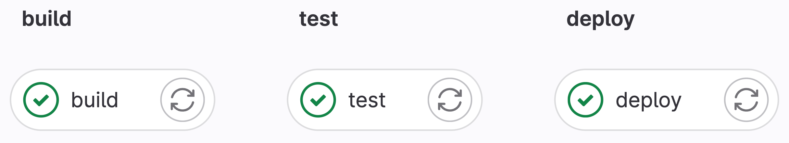
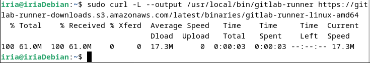
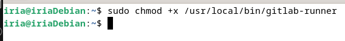
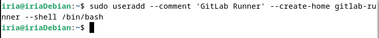
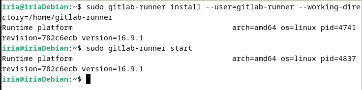
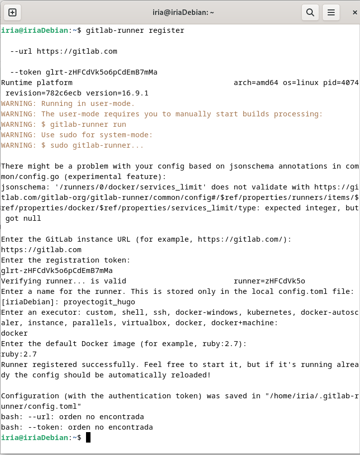
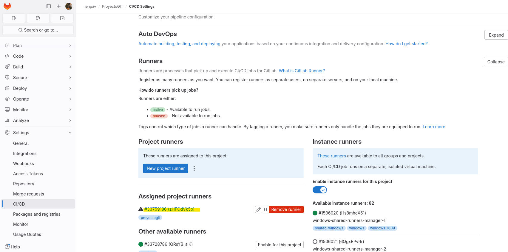
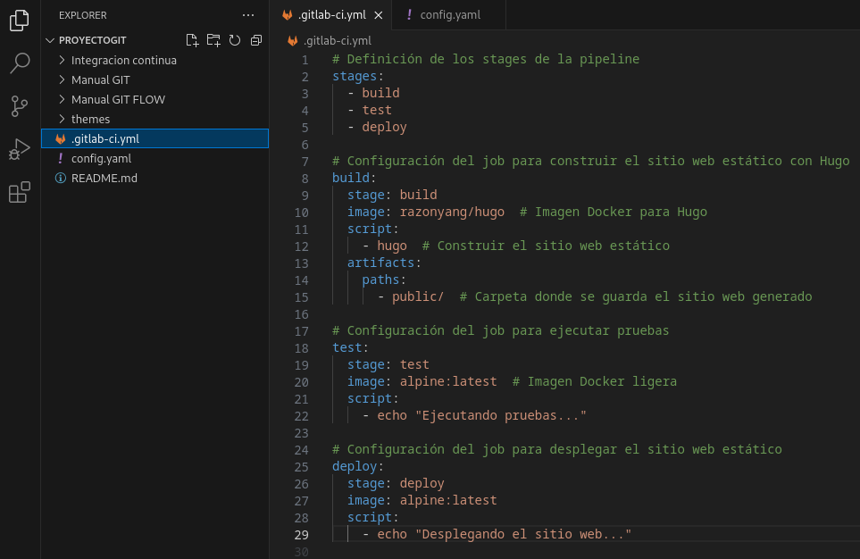
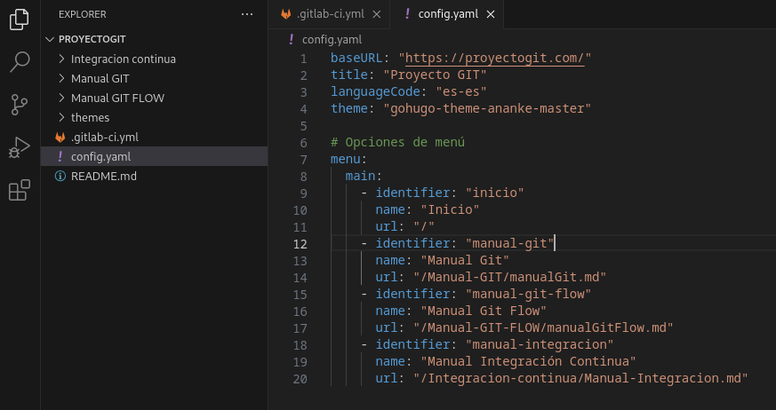
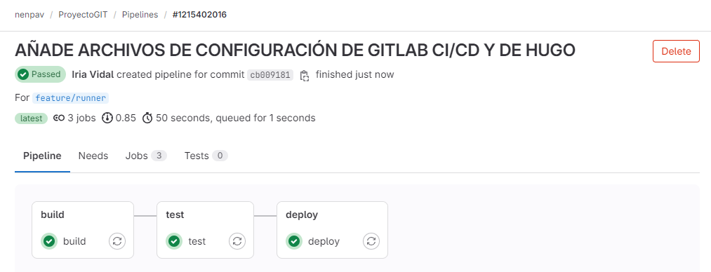

# MANUAL DE INTEGRACIÓN CONTINUA

## ÍNDICE DE CONTENIDOS

1. Integración continua
2. Herramientas
3. Implementación
4. Bibliografía 

## 1. INTEGRACIÓN CONTINUA

La integración continua es un sistema que permite automatizar el proceso de desarrollo de software, de forma que cuando se añaden nuevas funcionalidades o se realizan cambios sobre este, se realizan de forma automática una serie de pasos: la incorporación de los cambios, las pruebas automáticas y el despliegue continuo.
Este sistema permite una mayor flexibilidad y facilidad en el trabajo colaborativo y en la elaboración de proyectos complejos o de larga duración, ya que mejora la comunicación entre los equipos y acorta los tiempos de desarrollo al tener procesos automatizados.

La integración continua consta, como se indicó anteriormente, de una serie de pasos que se explicarán brevemente a continuación:

- Entrega continua: en este paso, se incorporan los cambios que se incluirán en la publicación aunque pero no se suben al server de pruebas de producción.

- Despliegue continuo: de forma automática, se sube al servidor de pruebas de producción, usando herramientas como Hugo. 

## 2. HERRAMIENTAS

- **Runners**:
  Es una entidad que ejecuta los trabajos definidos en los pipelines de CI/CD. Es decir, es un agente que se encarga de llevar a cabo las tareas automatizadas que se han configurado en el proceso de integración continua.

Los runners pueden ser de diferentes tipos y están asociados a un proyecto o a un grupo de proyectos. Hay runners compartidos que están disponibles para todos los proyectos, runners de grupo que funcionan para todos los proyectos dentro de un grupo, y runners de proyecto específicos que están asignados a un proyecto particular.

Cuando se registra un runner en GitLab, se está estableciendo una conexión entre la instancia de GitLab y el entorno donde se ejecutarán los trabajos. Este entorno puede ser una máquina física, una máquina virtual, un contenedor Docker, un clúster de Kubernetes, o incluso instancias escaladas automáticamente en la nube.

- **Pipeline**:
  Es una serie de pasos automatizados que se ejecutan en respuesta a un evento de integración continua y entrega continua (CI/CD), como la confirmación de cambios en un repositorio de código. Una pipeline representa el flujo de trabajo automatizado que sigue el proyecto desde el código fuente hasta su despliegue.

Cada pipeline está compuesta por una serie de "jobs" (trabajos) que se ejecutan en secuencia o en paralelo, dependiendo de cómo se hayan configurado. Estos trabajos pueden realizar diversas tareas, como la compilación del código, ejecución de pruebas automatizadas, análisis estático del código, construcción de artefactos, despliegue en entornos de prueba o producción, entre otros.

Las pipelines de GitLab se definen en un archivo llamado **.gitlab-ci.yml** que se encuentra en la raíz del repositorio. En este archivo, se pueden especificar los pasos que se desean que se realicen en el pipeline, así como las condiciones bajo las cuales deben ejecutarse esos pasos.

Cada vez que se activa un evento de CI/CD, como una confirmación de código, GitLab leerá el archivo .gitlab-ci.yml, interpretará las instrucciones definidas en él y ejecutará los trabajos correspondientes en la pipeline. GitLab proporciona una interfaz gráfica para visualizar el progreso de la pipeline, así como los resultados de cada trabajo ejecutado.

- **Stages (etapas)**:
  Son divisiones lógicas en el pipeline de CI/CD que agrupan y organizan los trabajos relacionados en función de su propósito o de la fase del proceso de desarrollo de software en la que se encuentran. Cada stage representa una fase o paso en el flujo de trabajo del pipeline.

Algunos ejemplos comunes de stages en un pipeline:

- Build (Construcción): en esta etapa se compila el código fuente y se generan los artefactos de construcción, como archivos binarios, ejecutables o paquetes distribuibles.

- Test (Pruebas): aquí se ejecutan pruebas automatizadas, como pruebas unitarias, pruebas de integración o pruebas de aceptación, para verificar que el código funciona correctamente.

- Deploy (Despliegue): esta etapa se encarga de desplegar la aplicación en un entorno de desarrollo, pruebas o producción, dependiendo de la configuración de tu pipeline.

## 3. IMPLEMENTACIÓN

En este apartado del manual se explicará brevemente, apoyándose con imágenes de ejemplo, cómo se realiza la configuración de la integracion continua desde GitLab.

1. **Creación del runner en Gitlab**

El primer paso consiste en la creación del runner desde Gitlab.

Para poder continuar con el proceso, se usará una MV Debian12 para que sirva de entorno de pruebas. 

2. **Instalación del binario en la MV**

Se realiza la instalación del ejecutable que contiene el gitlab runner en la máquina virtual como se muestra en la siguiente imagen. 

3. **Se le añaden permisos de ejecución**

Para que se pueda ejecutar correctamente, se añaden los permisos de ejecución al runner.

4. **Creación del usuario para gitlab runner**

Se crea el usuario "Gitlab Runner".

5. **Instalación del Runner**

Se instala el runner indicando el usuario de gitlab runner anteriormente creado. Una vez realizada la instalación, se inicia el runner. 

6. **Configuración**

Se registró un nuevo corredor de GitLab en el sistema local. Se proporcionó la URL de la instancia de GitLab, el token de registro y un nombre para el corredor (proyectogit_hugo). Se eligió el tipo de ejecutor como docker y se especificó la imagen Docker predeterminada (ruby:2.7) que utilizará el corredor para ejecutar trabajos. Después de completar el registro, el corredor quedó listo para ser iniciado y utilizado en el proyecto de GitLab.

7. **Resultado del runner en Gitlab**

La siguiente imagen muestra que el runner se ha creado correctamente y se visualiza en la página del proyecto de Gitlab.

8. **Configuración de gitlab CI/CD**

Se edita el fichero .gitlab-ci.yml para poder configurar la integración continua en el proyecto, especigicando los diferentes stages.

9. **Configuración de HUGO**

Se edita el fichero config.yaml para configurar el despliegue automático con HUGO.

10. **Resultado de la integración continua**

En al siguiente imagen se muestra el runner con la pipeline del proyecto, donde se puede comprobar que al hacer un cambio, se han pasado todos los stages, build, test y deploy. 

## 4. BIBLIOGRAFÍA

Atlassian. (s/f). Tutorial sobre implementación continua. Atlassian. Recuperado el 15 de marzo de 2024, de https://www.atlassian.com/es/devops/continuous-delivery-tutorials/continuous-deployment-tutorial

Create a GitLab Pages deployment for a static site. (s/f). Gitlab.com. Recuperado el 15 de marzo de 2024, de https://docs.gitlab.com/ee/user/project/pages/getting_started/pages_ui.html

GitLab CI/CD examples. (s/f). Gitlab.com. Recuperado el 15 de marzo de 2024, de https://docs.gitlab.com/ee/ci/examples/

GitLab runner. (s/f). Gitlab.com. Recuperado el 15 de marzo de 2024, de https://docs.gitlab.com/runner/

Izertis. (2017, marzo 3). Integración Continua rápida y sencilla con GitLab CI. Solid GEAR. https://ahorasomos.izertis.com/solidgear/gitlab_countinuous_integration_intro/

¿Qué es la implementación continua? (s/f). Ibm.com. Recuperado el 15 de marzo de 2024, de https://www.ibm.com/mx-es/topics/continuous-deployment

¿Qué es una tubería CI/CD? - Software Check Point. (2021, junio 16). Check Point Software. https://www.checkpoint.com/es/cyber-hub/cloud-security/devsecops/what-is-a-ci-cd-pipeline/

Runner SaaS. (s/f). Gitlab.com. Recuperado el 15 de marzo de 2024, de https://docs.gitlab.com/ee/ci/runners/index.html
