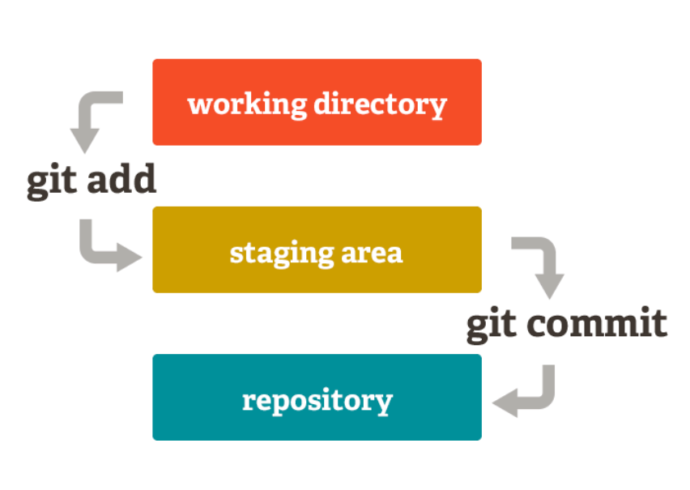

# MANUAL DE GIT

## ÍNDICE DE CONTENIDOS

1. **Conceptos básicos**

Este manual ofrece una breve explicación para aprender a usar GIT como sistema de control de versiones, tratando diferentes puntos, como sus ventajas, características y comandos básicos.

**Sistemas de control de versiones**

Git es el estándar, a nivel mundial, para el control de versiones. Por lo tanto, antes de entender el funcionamiento de GIT, se debe explicar levemente qué son los sistemas de control de versiones.

Los sistemas de control de versiones o VCS permiten registrar todos los cambios realizados en un fichero o proyecto quedando constancia de las diferentes versiones por las que va pasando el proyecto, pudiendo recuperar versiones anteriores en caso de ser necesario.

Los VCS han ido evolucionando a lo largo del tiempo, desde sistemas locales, sistemas centralizados a, finalmente, sistemas distribuidos como es el caso de GIT. Estos últimos han supuesto un avance con respecto a los sistemas anteriores ya que, debido a su funcionamiento, solucionaron muchos de los problemas que acarreaban hasta ese momento los sistemas centralizados, como la pérdida de datos o la incapacidad de trabajar en el proyecto en caso de que se cayese el servidor donde estaba alojado.

2. ## Funcionamiento

Git, a diferencia de otros VCS, no guarda las diferencias entre las versiones, sino que realiza una instantánea de esa versión guardando su referencia.

Otro de los aspectos clave del funcionamiento de Git es la integridad, ya que posee un sistema de verificado (checksum) por el cual todos los cambios efectuados en el proyecto serán detectados, impidiendo la pérdida de información. Esta suma de comprobación se realiza mediante el hash SHA-1, el cual también es usado por Git como identificador para guardar toda la información.

***Los tres estados***
El aspecto más importante para poder entender el funcionamiento interno de GIT, es que presenta tres estados diferentes:
- confirmado **(committed)** : los datos están almacenados localmente.
- modificado **(modified)** : el fichero o proyecto ha sido modificado pero no se han confirmado los cambios.
- preparado **(staged)** : todas las modificaciones del proyecto se han registrado en su versión más reciente a la espera de ser confirmadas (hacer commit).

La existencia de estos tres estados, implica la existencia de tres secciones diferentes dentro de cualquier proyecto en Git, lo que se conoce como  __arquitectura de tres árboles__:
- Directorio de trabajo: es una copia de una de las versiones del proyecto, que permite el uso y modificación de los diferentes archivos del proyecto.
- Área de preparación o "index": es la sección donde se almacena la información que será incluida en el siguiente commit.
- Directorio de Git: es la principal sección de Git, en la cual se almacenan los metadatos y la base de datos de objetos del proyecto. También es la sección que se copia al realizar una clonación desde un equipo local. Para ser más precisos, el "index" también está incluído dentro del directorio de GIT, como se muestra en la siguiente imagen, pero se separa en la explicación para una mejor comprensión del flujo de trabajo de Git.

Por lo tanto, el flujo de trabajo más básico en GIT sería el siguiente:
- Se modifica el proyecto en el directorio de trabajo local.
- Se preparan los archivos y se añaden al área de preparación o index.
- Se confirman los cambios (commit) y se realiza una instantánea en el directorio de Git.

### Directorio de GIT (.git)

El directorio .git, es la sección más importante de las mencionadas anteriormente, por eso se debe dedicar un apartado específico para explicar su estructura interna. Este directorio está formado, entre otros, por estos componentes:

1. Directorio objects/ 

En este directorio se almacenan los objetos, como los datos de los ficheros, los commits, los árboles y las Tags.

2. Directorio refs

En este directorio se almacenan las referencias de las distintas versiones del proyecto.

3. Directorio logs

En este directorios se guardan todos los cambios del proyecto.

4. Directorio worktrees

En todo proyecto de git existe un árbol de trabajo principal, pero pueden aparecen diferentes árboles de trabajo vinculados. En este directorio, se almacenan las relaciones del árbol principal con cada uno de los árboles de trabajo vinculados.

5. Fichero HEAD

Este fichero es importante para entender el funcionamiento de Git. En él se guarda la referencia simbólica de la rama en la que se trabaja en cada momento. Es decir, es a donde apunta el puntero para realizar las diferentes operaciones.

6. Fichero config

En este ficher se guarda la configuración de Git, como equipos remotos, el flujo de las ramas, etc.

7. Fichero Index

Este fichero es el más importante del directorio de Git. Se almacenan todos los cambios a la espera de ser confirmados, en forma de lista ordenada de rutas.

3. ## Ventajas

GIT se ha convertido en el estándar mundial como sistema de control de versiones debido a las numerosas ventajas que aporta con respecto a otros sistemas anteriores. El hecho de ser un programa de código abierto y gratuito, ha favorecido que se haya formalizado como una herramienta imprescindible para empresas y particulares para el desarrollo de proyectos.

Una de las mayores ventajas de Git es que, como se comentó anteriormente, es un sistema distribuido, lo que permite una mayor flexibilidad en la elaboración de proyectos colaborativos. Esta naturaleza distribuida también permite adoptar diferentes estrategias en el flujo de trabajo como Administrador-Integración, Dictador-Teniente, etc.

En el punto anterior, se mencionaba que Git utiliza un checksum para mantener la integridad de los datos. Este sistema de seguridad es altamente beneficioso ya que evita la pérdida de información al estar todos los cambios identificados por el hash. Otro aspecto que mejora la seguridad en git es la forma de trabajar en local, ya que mientras los cambios no se confirman mediante un commit, todas las operaciones y todos los cambios se mantienen en el repositorio local, lo cual permite corregir errores y evitar la corrupción de los datos. 

Otra de las ventajas de Git, es la forma en la que se manejan los cambios, almacenándolos como instantáneas en un sistema de miniaturas. Esto, junto al uso del almacenamiento local, mejora la velocidad y la eficiencia al realizar diferentes operaciones, como commit o merge. Además, el hecho de que se almacenen instantáneas incrementales de todos los cambios realizados, permite revertir el trabajo a versiones anteriores pudiendo solucionar errores con facilidad. 

La existencia de ramas y su manejo sencillo permite la elaboración en pararelo de diferentes partes del proyecto, pudiendo dividir el trabajo de forma más eficiente y facilitando el trabajo colaborativo entre diferentes equipos en proyectos de gran envergadura. 

Gracias a la integración de Git en servidores como GitHub o Gitlab, se permite el trabajo de forma remota, facilitando el trabajo colaborativo y la productividad de los equipos de desarrollo. Además, existen extensiones y pluggins para el uso de git en diferentes herramientas y softwares de desarrollo como Visual Studio o Eclipse que facilitan el control de los cambios durante el desarrollo del proyecto. 

4. **Comandos básicos**

### CONFIGURACIÓN DE GIT (GIT CONFIG)

- **git config --global user.name "tunombre"**: establece el nombre de usuario
- **git config --global user.email "tuemail"**: establece el correo electrónico
- **git config --list**: muestra la configuración

### CREACIÓN DE REPOSITORIOS (GIT INIT)

- **git init "nombre-repositorio"**: crea una nueva carpeta con el nombre del repositorio que a su vez contiene otra carpeta oculta llamada **.git** que contiene la base de datos donde se registran los cambios en el repositorio.
  ("nombre-repositorio" es opcional. Si se proporciona, crea una carpeta con ese nombre y convierte esa carpeta en un repositorio Git, pero si no se proporciona, simplemente convierte el directorio actual en un repositorio Git)

### COPIA DE REPOSITORIOS (GIT CLONE)

- **git clone "url-repositorio"**: crea una copia local del repositorio que se le indica. Una vez creada la copia los dos repositorios (original y copia) son independientes el uno del otro.
  (Si no se especifica un "nombre-repositorio" después de la URL, Git automáticamente utilizará el nombre del repositorio remoto para crear la carpeta local.)

### AÑADIR CAMBIOS A LA ZONA DE INTERCAMBIO TEMPORAL (GIT ADD)

- **git add "fichero"**: añade los cambios en el fichero del directorio de trabajo a la zona de intercambio temporal.
- **git add "carpeta"**: añade los cambios en todos los ficheros de la carpeta del directorio de trabajo a la zona de intercambio temporal.
- **git add .**: añade todos los cambios de todos los ficheros no guardados aún en la zona de intercambio temporal.
- **git remote add "repositorio-remoto" "url"**: crea un enlace con el nombre "repositorio-remoto" a un repositorio remoto ubicado en la dirección "url".

### AÑADIR CAMBIOS AL REPOSITORIO (GIT COMMIT)

- **git commit -m "mensaje"**: confirma todos los cambios de la zona de intercambio temporal añadiéndolos al repositorio y creando una nueva versión del proyecto.
- **git commit**: realiza la misma acción que el anterior pero en vez de escribir directamente el mensaje en el comando se abrirá un editor de texto donde se puede escribir el mensaje.
- **git commit --amend -m "mensaje"**: cambia el mensaje del último commit por el nuevo mensaje.

### REGLAS DE REDACCIÓN DE COMMITS

- Título en mayúsculas, corto, conciso e imperativo.
- Breve texto que explique qué hace el commit y por qué, evitando el cómo. También en presente e imperativo.
- Información adicional como el número del ticket que cierra este cambio o los tickets relacionados.

### MOSTRAR ESTADO DE UN REPOSITORIO (GIT STATUS)

- **git status**: muestra el estado de los cambios en el repositorio desde la última versión guardada.

### MOSTRAR HISTORIAL DE VERSIONES DE UN REPOSITORIO (GIT LOG)

- **git log**: muestra el historial de commits de un repositorio ordenado cronológicamente. Para cada commit muestra su código hash, el autor, la fecha, la hora y el mensaje asociado.

### MOSTRAR DATOS DE UN COMMIT (GIT SHOW)

- **git show**: muestra el usuario, el día, la hora y el mensaje del último commit, así como las diferencias con el anterior.
- **git show "commit"**: muestra el usuario, el día, la hora y el mensaje del commit indicado, así como las diferencias con el anterior.

### MOSTRAR LAS DIFERENCIAS ENTRE VERSIONES (GIT DIFF)

- **git diff**: muestra las diferencias entre el directorio de trabajo y la zona de intercambio temporal.
- **git diff --cached**: muestra las diferencias entre la zona de intercambio temporal y el último commit.
- **git diff HEAD**: muestra la diferencia entre el directorio de trabajo y el último commit.

### ELIMINAR CAMBIOS

- **git checkout "commit" -- "file"**: actualiza el fichero "file" a la versión correspondiente al commit.
- **git reset "fichero"**: elimina los cambios del fichero de la zona de intercambio temporal, pero preserva los cambios en el directorio de trabajo.
- **git reset --hard "commit"**: elimina todos los cambios desde el commit y actualiza el HEAD a este commit.
- **git reset "commit"**: actualiza el HEAD al commit, es decir, elimina todos los commits posteriores a este commit, pero no elimina los cambios del directorio de trabajo.

### RAMAS

- **git branch "rama"**: crea una nueva rama con el nombre "rama" en el repositorio a partir del último commit.
- **git branch**: muestra las ramas activas de un repositorio indicando con \* la rama activa en ese momento.
- **git branch -d "rama"**: elimina la rama de nombre "rama" siempre y cuando haya sido fusionada previamente.
- **git branch -D "rama"**: elimina la rama de nombre "rama" incluso si no ha sido fusionada. Si la rama no ha sido fusionada previamente se perderán todos los cambios de esa rama.

- **git log**: muestra la historia del repositorio.

- **git checkout "rama"**: actualiza los cheros del directorio de trabajo a la última versión del repositorio correspondiente a la rama rama", y la activa, es decir, HEAD pasa a apuntar al último commit de esta rama.
- **git checkout -b "rama"**: crea una nueva rama con el nombre "rama" y la activa. Este comando es equivalente aplicar los comandos git branch "rama" y después git checkout "rama".

- **git merge "rama"**: integra los cambios de la rama "rama" en la rama actual.

### CAMBIOS DESDE UN REPOSITORIO REMOTO

- **git pull "remoto" "rama"**: descarga los cambios de la rama del repositorio remoto y los integra en la última versión del repositorio local, es decir, en el HEAD.
- **git fetch "remoto"**: descarga los cambios del repositorio remoto pero no los integra en la última versión del repositorio local.
- **git push "remoto" "rama"**: sube al repositorio remoto los cambios de la rama en el repositorio local.

(Es útil mencionar que antes de ejecutar git push, es recomendable ejecutar git pull o git fetch para asegurarse de que el repositorio local esté actualizado con los cambios más recientes del repositorio remoto)

5. **Distintos tipos de clientes**
   Un cliente GIT es una interfaz o herramienta que los usuarios pueden utilizar para interactuar con Git y gestionar sus respositorios.

- **Interfaz de línea de comandos (CLI)**: éste es el cliente original de Git y proporciona acceso completo a todas las funcionalidades de Git a través de comandos de texto en la línea de comandos _(para información sobre comandos véase el punto 4 de este manual)_. Se caracteriza por su mayor potencia y flexibilidad.
  _Ventajas_: como antes mencionado, la potencia y flexibilidad, pero también a mayores su eficiencia y rapidez.
  _Inconvenientes_: Curva de aprendizaje empinada y un poco intimidante al principio, y también mayor propensión a errores.

- **Interfaces gráficas de usuario (GUI)**: éstas son aplicaciones con interfaces gráficas que proporcionan una forma más visual e intuitiva de interactuar con Git. Ejemplos populares incluyen GitKraken (multiplataforma), Sourcetree (para Windows) o GitUp (para Mac).
  _Ventajas_: al contrario de la CLI, son más intuitivas y visuales, y tienen una menor curva de aprendizaje.
  _Inconvenientes_: menor flexibilidad y dependencia del software.

- **Integración con IDEs y editores de código**: muchos IDEs y editores de código tienen integración directa con Git, lo que permite realizar operaciones de control de versiones directamente desde el entorno de desarrollo. Por ejemplo Visual Studio Code.
  _Ventajas_: integración perfecta lo que permite la fluidez del flujo de trabajo. También podemos encontrar funcionalidades adicionales.
  _Inconvenientes_: dependencia del IDE.

 
6. Integración con otras herramientas
   Git es una herramienta de control de versiones distribuido que proporciona potentes capacidades de seguimiento de cambios y colaboración. Sin embargo, su valor se maximiza cuando se integra con otras herramientas y tecnologías que complementan su funcionalidad y mejoran el flujo de trabajo del equipo y la colaboración en proyectos.

Diferentes tipos de integraciones:

- **Integración con sistemas de control de versiones centralizados**: como por ejemplo **Subversion (SVN)**, permite trabajar con ambos sistemas en un entorno híbrido. Herramientas como **git-svn** facilitan la migración de SVN a Git y el uso conjunto de ambas plataformas. Esto ofrece flexibilidad a los equipos para aprovechar las ventajas de Git mientras trabajan con repositorios SVN existentes.

- **Integración con servicios de alojamiento de repositorios**: Git se integra con servicios de alojamiento de repositorios como **GitHub, GitLab y Bitbucket**. Los equipos pueden utilizar estas plataformas para alojar, colaborar y compartir repositorios Git, así como aprovechar características adicionales como la revisión de código, la gestión de problemas y la integración continua.

- **Integración con herramientas de gestión de proyectos**: Git se puede integrar con herramientas de gestión de proyectos como **Jira, Trello, Asana**, entre otras. Los equipos pueden vincular commits, ramas y problemas de Git a elementos de seguimiento en estas herramientas para mejorar la trazabilidad y la gestión de tareas.

- **Integración con herramientas de integración continua (CI)**: Git se integra con herramientas de CI/CD como **Jenkins, Travis CI, CircleCI**, etc. Estas herramientas pueden utilizar Git para desencadenar y automatizar pipelines de CI/CD basados en cambios en el repositorio.

- **Integración con IDEs y editores de código**: Git se integra con IDEs populares como **Visual Studio, IntelliJ IDEA, Eclipse**, así como con editores de código como **Visual Studio Code, Sublime Text, Atom**, entre otros. Estas herramientas proporcionan funcionalidades integradas de control de versiones, como la visualización de historial, la resolución de conflictos y la gestión de ramas.
  Un ejemplo de integración de GIT en Visual Studio Code:
  

- **Integración con herramientas de revisión de código**: Git se integra con herramientas de revisión de código como **Gerrit, Crucible, Review Board**, entre otras. Estas herramientas facilitan la revisión y discusión de cambios de código dentro del contexto de un repositorio Git.

7. ## BIBLIOGRAFÍA

- Chacon, S. (2009). Pro Git (1a ed.). APress.

- De versiones, S. de C. de V. S. de C. (s/f). Introducción a GITIntroducción a GIT. Aprendeconalf.es. Recuperado el 14 de marzo de 2024, de https://aprendeconalf.es/docencia/git/manual/manual-git.pdf

- DevOps, aspectos internos de GIT: arquitectura y archivos de índice. (s/f). Microsoft.com. Recuperado el 14 de marzo de 2024, de https://learn.microsoft.com/es-es/archive/msdn-magazine/2017/august/devops-git-internals-architecture-and-index-files

- Git - Flujos de trabajo distribuidos. (s/f). Git-scm.com. Recuperado el 14 de marzo de 2024, de https://git-scm.com/book/es/v2/Git-en-entornos-distribuidos-Flujos-de-trabajo-distribuidos

- Git - git como cliente. (s/f). Git-scm.com. Recuperado el 14 de marzo de 2024, de https://git-scm.com/book/es/v2/Git-y-Otros-Sistemas-Git-como-Cliente

- Git - Git mediante Línea de Comandos. (s/f). Git-scm.com. Recuperado el 14 de marzo de 2024, de https://git-scm.com/book/es/v2/Ap%C3%A9ndice-B%3A-Integrando-Git-en-tus-Aplicaciones-Git-mediante-L%C3%ADnea-de-Comandos

- Git - interfaces gráficas. (s/f). Git-scm.com. Recuperado el 14 de marzo de 2024, de https://git-scm.com/book/es/v2/Ap%C3%A9ndice-A%3A-Git-en-otros-entornos-Interfaces-gr%C3%A1ficas

- Hosting, S. W. (s/f). ¿Cómo estructura GIT el contenido del repositorio? Recursos de conocimiento de SiteGround. Recuperado el 14 de marzo de 2024, de https://www.siteground.es/kb/estructura-git-contenido-repositorio/

- Trabaja en dos (o más) ramas de git al mismo tiempo. (s/f). ..Ed.team. Recuperado el 14 de marzo de 2024, de https://ed.team/blog/trabaja-en-dos-o-mas-ramas-de-git-al-mismo-tiempo