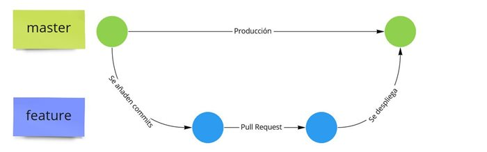
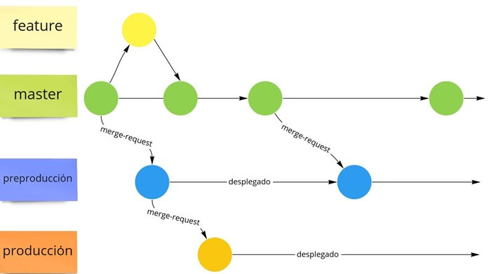
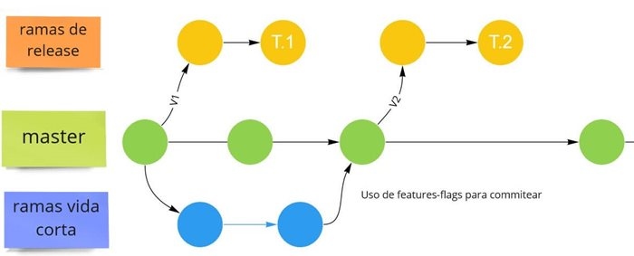
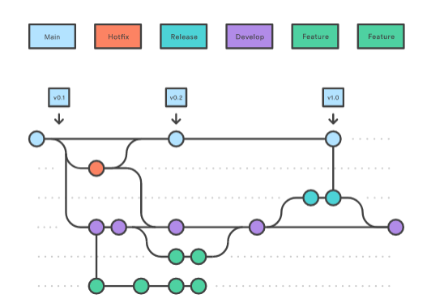
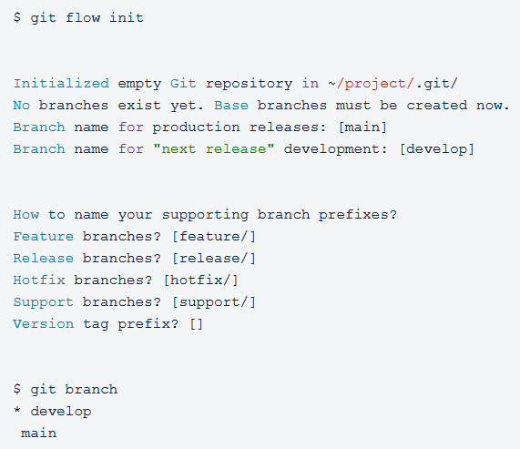
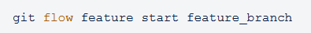
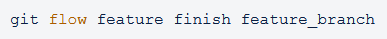
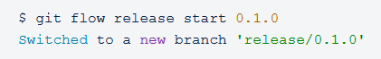
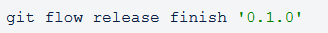
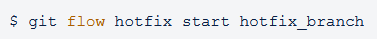

# MANUAL DE GIT FLOW

## ÍNDICE DE CONTENIDOS

1. ## INTRODUCCIÓN
   GitFlow se define como un sistema de branching o ramificación o modelo de manejo de ramas en Git, en el que se usan las ramas principales y la feature. De modo que la rama feature la crean los desarrolladores para fusionarla con la rama principal, únicamente cuando cumpla con sus labores.

Este sistema se caracteriza, además, por incluir múltiples ramas de mayor duración y más commit o confirmaciones.

Gitflow ha perdido popularidad en beneficio de los flujos de trabajo basados en troncos, que ahora se consideran prácticas recomendadas para el desarrollo continuo de software y las prácticas de DevOps. Además, puede ser difícil utilizar Gitflow con CI/CD.

https://keepcoding.io/blog/que-es-gitflow/
https://www.atlassian.com/es/git/tutorials/comparing-workflows/gitflow-workflow

2. ## VENTAJAS Y MOTIVOS

### Ventajas:

1. **Agilización de procesos**: GitFlow acelera la velocidad de los procesos que conducen a la entrega del código terminado al equipo de pruebas.

2. **Reducción de errores humanos**: el modelo de GitFlow ayuda a disminuir los errores humanos al evitar la mezcla accidental de ramas, ya que estos procesos son manejados directamente por el sistema.

3. **Independencia de funcionalidades**: elimina la necesidad de depender de funcionalidades específicas para llevar a cabo tareas relacionadas con la entrega de código para producción.

4. **Soporte efectivo de fallos**: puede implementarse para mantener un proceso efectivo de soporte de fallos y realizar actualizaciones rápidas.

5. **Trabajo colaborativo**: facilita el trabajo conjunto en una misma característica, lo que lo hace ideal para equipos con varios desarrolladores.

6. **Adecuado para proyectos complejos**: los beneficios de GitFlow lo hacen adecuado para proyectos con niveles altos de complejidad, aunque su manejo puede resultar algo complejo.

### Motivos:

#### Motivos para utilizar Git Flow:

- **Gestión de versiones y colaboración sólidas**: Git Flow es ideal cuando se necesita una gestión de versiones y colaboración estructuradas en un proyecto.

- **Releases regulares y controladas**: es útil si el proyecto requiere hacer releases de manera regular y controlada, proporcionando un marco para organizar y gestionar estas versiones.

#### Motivos para no utilizar Git Flow:

- **Proyectos pequeños o equipos reducidos**: en proyectos pequeños o con un equipo de desarrollo muy reducido, Git Flow puede generar demasiadas ramas y procesos adicionales, lo que puede resultar engorroso y complicado de manejar.

- **Alta incertidumbre o cambios constantes**: no es la mejor opción para proyectos con un alto grado de incertidumbre o cambios constantes, ya que puede resultar difícil seguir el flujo de trabajo establecido, lo que podría generar confusión y obstaculizar la productividad del equipo.

https://keepcoding.io/blog/que-es-gitflow/
https://willywes.medium.com/por-qu%C3%A9-es-una-buena-idea-utilizar-gitflow-c92c5e7754e0

3. ## WORKFLOWS: ALTERNATIVAS A GIT FLOW

Existen diversos workflows alternativos a Git Flow que ofrecen enfoques diferentes para la gestión de ramas y versiones en proyectos de desarrollo de software. Estos workflows, adaptados a las necesidades específicas de cada equipo o proyecto, pueden proporcionar una mayor flexibilidad y eficiencia en el flujo de trabajo colaborativo.

### Github Flow

GitHub Flow es un proceso que se distingue de GitFlow por la ausencia de la rama "develop". Se fundamenta en los siguientes principios:

- Todo lo que esté en la rama principal ("master") debe ser desplegado.
- Para cada nueva característica, creamos una rama de la rama principal usando un nombre descriptivo.
- Hacemos commits en esta rama localmente y realizamos un push con el mismo nombre en el servidor.
- Si necesitamos retroalimentación, empleamos herramientas de mergeo como solicitudes de extracción (pull request).
- Una vez que se ha revisado el código, podemos fusionarlo con la rama principal.
- Después de la fusión con la rama principal, desplegamos los cambios.

**Pros:**

- Compatible y fácil de usar con las herramientas actuales de Integración Continua/Entrega Continua (CI/CD).
- Recomendado para características de corta duración (diarias o incluso de horas).
- Un flujo ligero y aconsejado si el proyecto requiere una entrega de valor constante.

**Contras:**

- La rama principal ("master") puede volverse inestable si no se utilizan adecuadamente las herramientas de pruebas y solicitudes de extracción.
- No es recomendado para múltiples entornos productivos.
- Dependiendo del producto, pueden existir restricciones en los despliegues, especialmente en aplicaciones como Servicios de Software como un Servicio (SaaS).

### GitLab Flow

GitLab Flow representa una alternativa o extensión de los enfoques de GitHub Flow y Git Flow, surgiendo para abordar las limitaciones percibidas en ambos flujos. Aunque GitHub establece que todo lo que está en la rama "master" debe ser desplegado, hay situaciones en las que esto no es factible o necesario. Por ejemplo, en aplicaciones iOS que deben pasar por la validación de la App Store, o cuando se necesitan ventanas de despliegue específicas debido a requisitos del cliente.

Este flujo propone el uso de la rama "master", ramas de características y ramas de entorno. Una vez que se completa una característica, se realiza una solicitud de fusión (merge request) hacia la rama "master". Cuando la rama "master" acumula varias características, se realiza una solicitud de fusión hacia preproducción con el conjunto de características anteriores, las cuales, a su vez, son candidatas para pasar a producción mediante otra solicitud de fusión. Esta metodología asegura una alta estabilidad en el código desplegado en producción, ya que se valida tanto a nivel individual de cada característica como en conjunto al pasar a preproducción o producción.

Este flujo no requiere la creación de ramas de releases, ya que cada entorno se despliega con cada solicitud de fusión aceptada.

**Pros:**

- Alta confianza en la versión de producción.
- Ciclo de desarrollo muy seguro, ya que se revisa el código tanto a nivel individual en cada característica como a nivel global al pasar a preproducción o producción, lo que ayuda a mitigar el impacto.
- Evita la sobrecarga de crear releases, etiquetados y fusiones a "develop".

**Contras:**

- Requiere un equipo que valide las solicitudes de fusión tanto de las características como de los diferentes entornos.
- Tiempo de entrega de valor prolongado, ya que desde la creación y validación de la característica hasta su llegada a producción, debe pasar por múltiples validaciones.
- Más complejo que GitHub Flow.

### Trunk-based Flow

Este flujo comparte similitudes con GitHub Flow, pero introduce la idea de las ramas de versiones y un cambio en la filosofía subyacente. Los principios que lo guían son los siguientes:

- Se fomenta la colaboración directa de los desarrolladores en el tronco principal (o master).
- Se desalienta la creación de ramas de características utilizando documentación técnica; en su lugar, se sugiere el uso de "features flags" (condicionales en el código) para activar o desactivar nuevas características en función de la complejidad de su evolución.
- Se recomienda preferentemente el uso de la metodología de Pair-Programming en lugar de las solicitudes de extracción (pull requests).
- Se crean ramas de versiones para facilitar el despliegue del código en diferentes entornos, como móvil, web, etc.

**Pros:**

- Altamente beneficioso para proyectos que necesitan iterar rápidamente y entregar valor de forma ágil.
- Es particularmente adecuado para equipos ágiles pequeños.
- Ideal para equipos que emplean la técnica de Pair-Programming.
- Funciona eficazmente con equipos experimentados y consolidados.

**Contras:**

- Requiere una responsabilidad elevada por parte de los desarrolladores para mantener un código de alta calidad.
- El proyecto debe contar con un control de calidad (QA) y un despliegue continuo (CD) muy maduros; de lo contrario, pueden introducirse numerosos errores en el tronco principal.
- No se recomienda su uso en proyectos de código abierto, ya que pueden requerir una verificación adicional del código.

### Master-only Flow

El enfoque de este flujo de trabajo se centra en el uso de una sola rama continua. En este caso, emplearemos "master" en esta explicación, ya que es una convención común en Git, aunque también podríamos utilizar otros nombres como "current", "default", "mainline", entre otros.

Cada característica o corrección de errores (hotfix) se desarrolla directamente en esta misma rama. Posteriormente, se realizan pruebas y commits localmente. Una vez que estos cambios son aprobados, se hace un push hacia la rama "master" en el repositorio remoto, desplegándose inmediatamente en producción.

Este flujo está diseñado para proyectos con un equipo de desarrolladores altamente experimentado y que fomentan el pair-programming.

Es crucial utilizar "features flags" para integrar el código en la rama principal y evitar conflictos a lo largo del tiempo.

**Pros:**

- Mantenemos una única rama, lo que simplifica la gestión.
- El historial del proyecto se mantiene limpio y claro.
- Con el uso de pair-programming y desarrolladores experimentados, la entrega de valor en producción es inmediata.

**Contras:**

- No es compatible con múltiples entornos productivos.
- Requiere desarrolladores con experiencia para mantener la estabilidad de la rama principal.
- El proyecto necesita pautas de código muy estrictas para garantizar la consistencia y calidad del código.

https://www.babelgroup.com/es/Media/Blog/Abril-2021/Cinco-Git-Workflows-para-mejores-proyectos

4. ## FUNCIONAMIENTO DE GIT FLOW

Gitflow se basa en la existencia y utilización de distintas ramas, cada una con un rol determinado, durante el desarrollo de un proyecto. De esta forma, no se trabaja únicamente sobre la rama master permitiendo un flujo de trabajo más flexible y con menos errores al hacer merge, donde cada equipo se puede centrar en el desarrollo de una parte sin afectar al trabajo de los demás.

Las ramas que usa Gitflow son las siguientes:

1. **Master o main**
   Rama principal que se crea cuando se inicia un nuevo repositorio en Git. En ella se guardará el historial de todas las versiones del software que han sido publicadas. Por lo tanto, esta rama solamente contendrá una parte de la totalidad del proyecto.

2. **Develop o dev**
   Esta rama es la rama de desarrollo donde se irán añadiendo las diferentes partes del proyecto. Por lo tanto, esta rama contiene la totalidad del proyecto, incluido el que todavía está en desarrollo, donde se irán fusionando todas ramas feature cada vez que se añada una nueva funcionalidad. Todos los equipos de desarrollo trabajarán a partir de esta rama, creando las diferentes features a partir de ella para luego fusionarlas a develop una vez que estén finalizadas.

3. **Feature**
   Las ramas features son las que se utilizan para añadir nuevas funcionalidades al proyecto. Como se indica en el apartado anterior, las ramas feature utilizan la rama develop como rama primaria, partiendo de ella y fusionándose de nuevo cuando la feature está terminada.

4. **Release**
   Las ramas de release sirven para guardar la parte del software que será publicado. Esta rama parte de la rama develop y, una vez incorporado el código, no se podrán añadir nuevas funcionalidades a esta rama. Estas nuevas funciones se quedarán en la rama develop a la espera de ser añadidas a la siguiente release. Los únicos cambios que se podrán realizar sobre esta rama son para la corrección de errores que no hayan sido detectados en la rama dev o en las features.
   En cuanto la pulicación esté preparada, se fusionará la rama release con la rama master, indicando en un TAG la versión correspondiente, y con la rama develop para que esta última contenga los últimas correcciones que se hayan podido realizar sobre la rama release y tenga siempre una copia completa de todo el código. Al igual que las features, una vez se haya fusionado con master y con develop, se eliminará la rama release.

5. **Hotfix**
   Estas ramas sirven para arreglar aquellos errores que deban ser correjidos rápidamente. Esta rama parte de la rama master, por lo que una vez correjido el problema, debe fusionarse de nuevo con esta añadiendo un nuevo TAG con la versión actualizada. También debe ser fusionada a la rama develop. La existencia de esta rama permite corregir los errores del código principal sin interrumpir el desarrollo de nuevas partes y sin tener que esperar a la próxima publicación para incluir las correcciones.

5. ## COMANDOS DEL WRAPPER DE GITFLOW

Usar la biblioteca de extensiones de git flow permite reducir las operaciones de git, ya que agrupa diferentes comandos en una sola instrucción.

- **git flow init**: inicia un repositorio de git usando las extensiones de git-flow, creando la rama develop directamente.

- **git flow feature start myfeature**: permite crear una nueva rama feature a partir de develop para añadir una nueva funcionalidad al código.

- **git flow feature finish myfeature**: este comando cambia la rama a develop y fusiona en ella la feature/myfeature.

- **git flow feature publish myfeature**: publica la feature en el servidor remoto. Equivalente a usar git push.

- **git flow feature pull origin myfeature**: permite añadir al repositorio local, la funcionalidad contenida en el servidor remoto.

- **git flow feature track myfeature**: permite visualizar el historial de cambios de la feature.

- **git flow release start 1.0.0**: cambia la rama a develop y desde ella crea una nueva rama release con la versión 1.0.0.

- **git flow release publish 1.0.0**: publica la release en el servidor remoto. Equivalente a usar git push. s

- **git flow release track 1.0.0**: permite ver el historial de cambios en la release.

- **git flow release finish '1.0.0'**: cambia la rama a master y fusiona en esta la release añadiendo como TAG el nombre de esta. También cambia a develop y fusiona en ella la release. Después, la release es eliminada.

- **git flow hotfix start myfix**: cambia la rama a master y crea una nueva rama hotfix para arreglar el error.

- **git flow hotfix finish myfix**: cambia la rama a main y fusiona en esta la rama hotfix. También cambia la rama a develop y fusiona la hotfix en ella. Finalmente, se elimina la rama hotfix.

https://www.atlassian.com/es/git/tutorials/comparing-workflows/gitflow-workflow
https://danielkummer.github.io/git-flow-cheatsheet/
